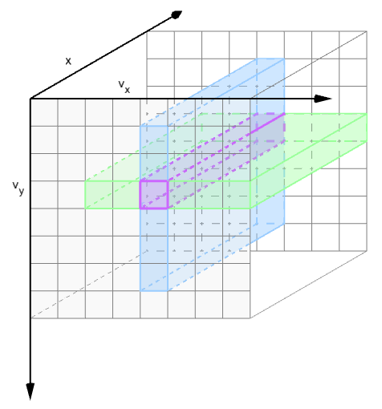

# À propos de la résolution numérique de Vlasov-Poisson

> Il ne s'agit pas ici d'effectuer toute la théorie de la résolutino de l'équation de Vlasov-Poisson mais plus de présenter les choix que nous avons pu effectuer dans la résolution numérique, et les implications que cela peut avoir sur l'implémentation.

Nous souhaitons résoudre un problème du type :

$$
  \begin{cases}
    \partial_t f + v\partial_x f + E\nabla_v\cdot f = 0 \\
    \partial_x E = \rho - 1
  \end{cases}
$$

avec $f(t=0,x,v) = f^0(x,v)$, $x\in [x_{\text{min}},x_{\text{max}})$ périodique, et $v\in\mathbb{R}^d$. 

Pour représenter au mieux le domaine de $v$ il est nécessaire de borner l'intervalle et prendre $v\in [v_{\text{min}},v_{\text{max}}]$. Pour simplifier l'implémentation des conditions aux bords, nous prendrons un domaine périodique, des conditions aux bords de Neumann ont déjà été testé sur le même type de problème, sans impact sur la solution.

## Méthode de résolution

Pour capturer la filamentation nous avons opté pour un schéma d'ordre élevé dans l'espace des phases : WENO d'ordre 5. L'étude de la CFL pour ce schéma avec différentes discrétisations en temps a déjà été effectué pour ce schéma [ici](cfl.ipynb). La CFL est guidé par $v_{\text{max}}$ et $E_{\text{max}}$ or $v_{\text{max}}$ est pris arbitrairement grand pour approximer au mieux les intégrales en vitesse. Nous avons donc :

$$
  E_{\text{max}} \ll v_{\text{max}}
$$

Par conséquent, pour pouvoir choisir le plus grand pas de temps possible il est intéressant de résoudre différemment le transport dans la direction $x$, à savoir à l'aide d'une transformée de Fourier :

$$
  \partial_t \hat{f} + vi\kappa\hat{f} + \widehat{(E\nabla_v\cdot f)} = 0
$$

Ce que l'on peut réécrire, pour utiliser un schéma Runge-Kutta exponentiel :

$$
  \partial_t (e^{iv\kappa t}\hat{f}) = - e^{iv\kappa t}\widehat{(E\nabla_v\cdot f)}
$$

Ainsi nous n'utiliserons le schéma WENO uniquement pour l'approximation de $E\nabla_v\cdot f$, donc pour estimer une dérivée en vitesse. La CFL sera alors guidé par $E_{\text{max}}$ qui n'est que de quelques unités. Ainsi le pas de temps $\Delta t$ imposé par cette CFL est le plus grand possible.

Cette équation peut être résolu par la méthode IFRK ([Isherwood L. et al](https://github.com/Kivvix/miMaS/blob/master/bibliography/pdf/2018-Isherwood(1).pdf)), qui est une méthode exponentielle basée sur RK, ainsi le schéma pour résoudre $u_t = Lu + N(u)$ où $L$ représente un opérateur linéaire (dans notre cas la multiplication par $-vi\kappa$) et $N$ un opérateur non-linéaire (ici le schéma WENO sur la FFT inverse), le schéma IFRK basé sur RK de Shu-Osher s'écrit alors :

$$
  \begin{aligned}
    u^{(1)} &= e^{L\Delta t}u^n + e^{L\Delta t}\Delta t N(u^n) \\
    u^{(2)} &= \frac{3}{4}e^{\frac{1}{2}L\Delta t}u^n + \frac{1}{4}e^{-\frac{1}{2}L\Delta t}u^{(1)} + \frac{1}{4}e^{-\frac{1}{2}L\Delta t}\Delta t N(u^{(1)}) \\
    u^{n+1} &= \frac{1}{3}e^{L\Delta t}u^n + \frac{2}{3}e^{\frac{1}{2}L\Delta t}u^{(2)} + \frac{2}{3}e^{\frac{1}{2}L\Delta t}\Delta t N(u^{(2)})
  \end{aligned}
$$

En appliquant ce schéma à notre équation :

$$
  \partial_t \hat{f} + vi\kappa\hat{f} + \widehat{(E\nabla_v\cdot f)} = 0
$$

on obtient le schéma suivant :

$$
  \begin{aligned}
    \hat{f}^{(1)} &= e^{-vi\kappa\Delta t}\hat{f}^n + e^{-vi\kappa\Delta t}\Delta t \widehat{(-E\nabla_v\cdot f^n)^{\texttt{W}}} \\
    \hat{f}^{(2)} &= \frac{3}{4}e^{-\frac{1}{2}vi\kappa\Delta t}\hat{f}^n + \frac{1}{4}e^{\frac{1}{2}vi\kappa\Delta t}f^{(1)} + \frac{1}{4}e^{\frac{1}{2}vi\kappa\Delta t}\Delta t \widehat{(-E\nabla_v\cdot f^{(1)})^{\texttt{W}}} \\
    \hat{f}^{n+1} &= \frac{1}{3}e^{-vi\kappa\Delta t}\hat{f}^n + \frac{2}{3}e^{-\frac{1}{2}vi\kappa\Delta t}f^{(2)} + \frac{2}{3}e^{-\frac{1}{2}vi\kappa\Delta t}\Delta t \widehat{(-E\nabla_v\cdot f^{(2)})^{\texttt{W}}}
  \end{aligned}
$$

## Choix d'implémentation

Nous souhaitons traiter des problèmes 1D$x$,$N_v$D$v$. La résolution en $x$ s'effectue avec un schéma global, il est donc intéressant de stocker de manière continue les données dans cette direction. En $v$ nous utiliserons le schéma WENO qui utilise un stencil de 5 pour évaluer $f_{i,k+\frac{1}{2}}^+$, nous utiliserons un stencil de 6 pour évaluer conjointement $f_{i,k+\frac{1}{2}}^+$ et $f_{i,k+\frac{1}{2}}^-$.

Pour des raisons de performance il est intéressant d'envoyer 6 itérateurs à une fonction `local_flux` pour calculer les valeurs de $f_{i,k+\frac{1}{2}}^+$ et $f_{i,k+\frac{1}{2}}^-$, et d'itérer dans un premier temps en $x$ (selon `i`).

